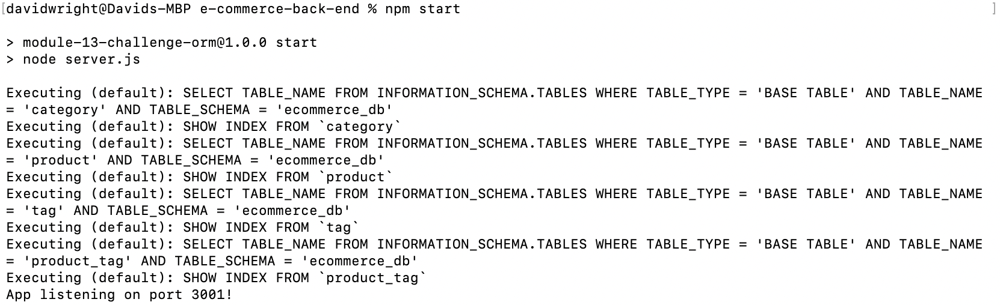
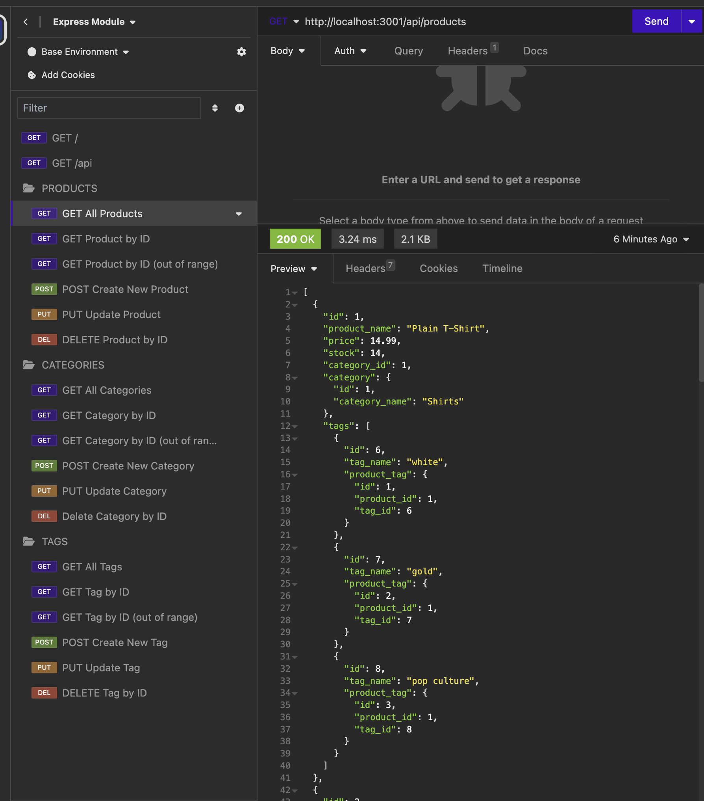

# E-Commerce Back End

## Description 

For this project, I had to build the back end for an e-commerce site. I had to take a working [Express.js](https://www.npmjs.com/package/express/v/4.17.1) API and configure it to use the [MySQl 2](https://www.npmjs.com/package/mysql2/v/2.1.0) and [Sequelize](https://www.npmjs.com/package/sequelize/v/6.34.0) packages to interact with a [MySQL](https://www.mysql.com/) database. I also used the [dotenv](https://www.npmjs.com/package/dotenv/v/8.2.0) package to store sensitive data, including the MySQL username, password, and database name.

The application contains three models: **Product**, **Category**, and **Tag**. All three models have full **Create, Read, Update, and Delete** (CRUD) capability, including
- GET all, 
- GET one by id, 
- POST (create), 
- PUT (update), and 
- DELETE.

Additionally, the models include proper association methods:
- **Category** and **Product** have a *one-to-many* association. A category can have many products, but a product can have only one category.
- **Tag** and **Product** have a *many-to-many* association. A tag can be assigned to many different products, and a product can be assigned to many different tags.

This application wasn't deployed, so I created a walkthrough video that demonstrates its functionality. A link to the video is provided below in the [Usage](#usage) section.


## Installation

Copy all files and folders from the repo to the desired location. On the command line, navigate to the installation directory and install dependencies with the command

```
npm install
```

Create the database from a MySQL command line in the same directory with the command

```
source db/schema.sql;
```
Seed the database from the same directory with the command

```
npm run seed
```

Create a ```.env``` file in the installation directory that contains the MySQL database name, username, and password. For the provided testing schema, the database name is ```ecommerce_db```.


## Usage

A video walkthrough demonstrating application functionality is available [here](https://watch.screencastify.com/v/x7WO4nYb6gloKhppT4Pj).

To start the server, use the command

```
npm start
```
or

```
node server.js
```



As this application is only the back end, routes and functionality can be demonstrated and tested using [Insomnia](https://insomnia.rest/products/insomnia), as shown in the screenshot below, as well as above in the walkthrough video.




## Credits

I used [Express](https://www.npmjs.com/package/express/v/4.17.1) to manage routing and middleware.

I used [dotenv](https://www.npmjs.com/package/dotenv/v/8.2.0) to store sensitive data and load environment variables.

I used [MySQL](https://www.mysql.com/), specifically [MySQL 2](https://www.npmjs.com/package/mysql2/v/2.1.0), to interface with the database.

I used [Sequelize](https://www.npmjs.com/package/sequelize/v/6.34.0) to define models, make associations, and handle requests.


## License

Please refer to the LICENSE in the repo.

---
